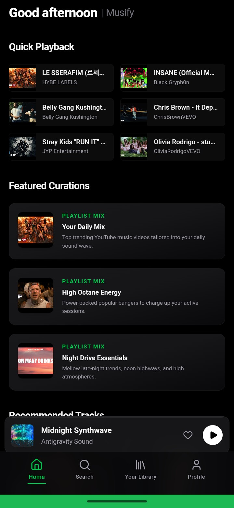
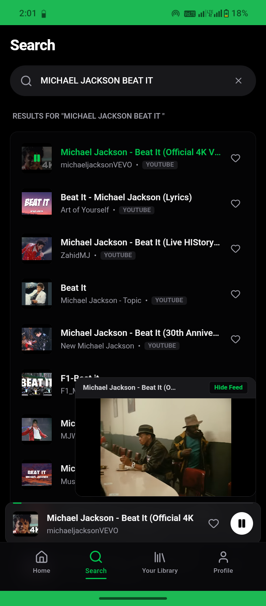
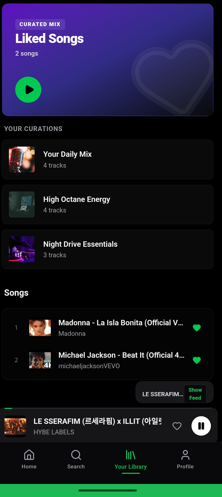

# 🎵 Musify

### Live App
https://musify-198541463114.asia-southeast1.run.app

Musify is a Spotify-style music streaming web application built with React, TypeScript, Supabase, YouTube Data API v3, Google AI Studio, and Claude AI assistance.

## Features

- 🔍 Search songs from YouTube
- 🎵 Audio playback
- ❤️ Like and save songs
- 🔐 User authentication
- ☁️ Cloud-synced library
- 📱 Mobile responsive
- 📲 Installable as Android PWA
- 🚀 Deployed on Google Cloud Run

## Tech Stack

- React
- TypeScript
- Supabase
- YouTube Data API v3
- Google Cloud Run
- Google AI Studio (Gemini)
- Claude AI
- PWA

## Live Demo

https://musify-198541463114.asia-southeast1.run.app

## Screenshots

### Home Screen

### Search Screen

### Now Playing

### Library

### Login Screen

## Developer

Bahawal Dilbagh Hashmi

ICS Student | App Developer | Future AI Engineer
